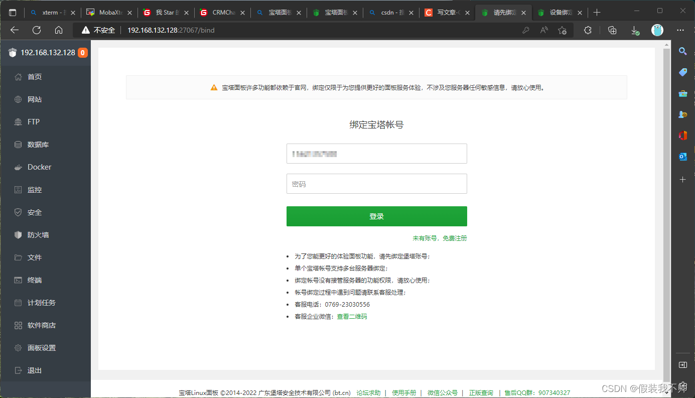

# 1.ubuntu安装宝塔面板  （需要备案的服务器）

```shell
wget -O install.sh http://download.bt.cn/install/install-ubuntu_6.0.sh && sudo bash install.sh ed8484bec
```

# 2. 远程链接查看

访问 http://192.168.132.128:27067/defa6112
输入用户名和密码
绑定宝塔账号



## 3.配置解析域名

`去自己的域名产商配置`

## 4.宝塔安装nginx并且创建站点


## 5.配置SSL证书


修改配置文件


```shell
location / {
        index index.php index.html index.htm default.php default.htm default.html;
        alias  /home/distribute/dist;
        proxy_set_header Host $host;
        proxy_pass http://localhost:10802/;
}
```

## 6.下载证书文件放桌面等下需要做证书加密 (目录证书都已经有了这里可以忽略)


## 7.生成打包证书文件
```shell
# 后面跟上你的域名
openssl req -newkey rsa:2048 -nodes -keyout server.key -x509 -days 365 -out ca.crt -subj "/C=CN/ST=GD/L=SZ/O=vihoo/OU=dev/CN=vpn.xiyankt.com/emailAddress=yy@vivo.com"

# server证书信息完成，也可以命令行指定各类参数
openssl req -new -key server.key -out server.csr -subj "/C=CN/ST=GD/L=SZ/O=vihoo/OU=dev/CN=vpn.xiyankt.com/emailAddress=yy@vivo.com"

# 生成的 csr签名请求文件可提交至 CA进行签发  ca.crt和ca.key是刚刚配置的域名下载下来的证书
openssl x509 -req -days 3650 -in server.csr -CA ca.crt -CAkey ca.key -CAcreateserial -out server.crt

```
生成的三个证书复制到目录下（直接用我的就行）


## 8.后端打成java，前端打成dist上传到服务器  截图我的服务器目录结构


## 9.安装jdk

#### 1.首先进行更新

```shell
sudo apt-get update
sudo apt-get upgrade
```


#### 2.安装jdk8

```shell
sudo apt install openjdk-11-jdk
```

#### 3.测试安装成功

```shell
java -version
```

## 10.安装gradle
```shell
wget https://services.gradle.org/distributions/gradle-5.6.4-all.zip

unzip gradle-5.6.4-all.zip
```

## 11.安装安卓sdk
```shell
https://wwpq.lanzoum.com/i4dsz0uhmcqd  （下载好，下载之后在上传到服务器）

unzip commandlinetools-linux-6858069_latest.zip

mkdir -p /home/distribute/sdk

cd /home/distribute/cmdline-tools/bin

./sdkmanager --list --sdk_root=/home/distribute/sdk					 #显示可安装包

./sdkmanager --install "platforms;android-29" --sdk_root=/home/distribute/sdk  #安装android-29

./sdkmanager --install "platform-tools" --sdk_root=/home/distribute/sdk       #安装platform-tools

./sdkmanager --install "build-tools;29.0.3" --sdk_root=/home/distribute/sdk    #安装build-tools

./sdkmanager --install "cmdline-tools;latest" --sdk_root=/home/distribute/sdk  #安装cmdline-tools

```

原文安装地址：https://blog.csdn.net/weixin_40668374/article/details/110529948


## 12.配置环境变量

```shell
vim /etc/profile
```

export GRADLE_HOME=/home/distribute/gradle-5.6.4
export PATH=$GRADLE_HOME/bin:$PATH
export ANDROID_HOME=/home/distribute/sdk

```shell
source /etc/profile
```

验证环境

```shell
java -version
gradle -version
```

## 13.mysql和redis安装比较简单，直接在宝塔安装就可以，我这就不演示了，

## 14.启动java程序
```shell
nohup java -jar ios-super-sign-0.0.1-SNAPSHOT.jar & > ios-super-sign.log
```

## 打开域名 注册第一个账户


#### 配置域名


