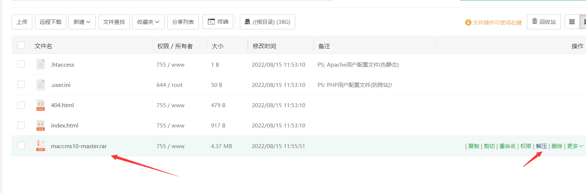
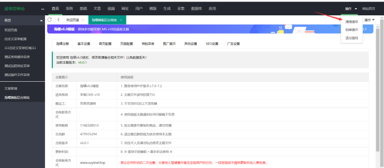
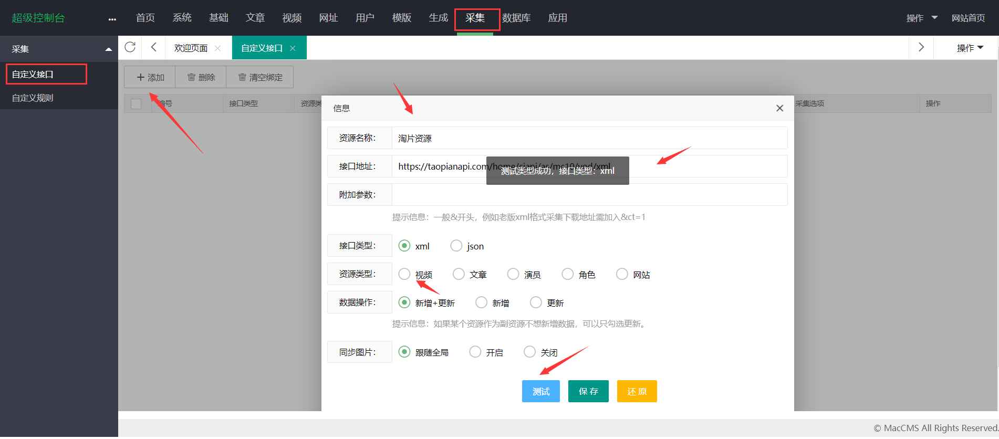
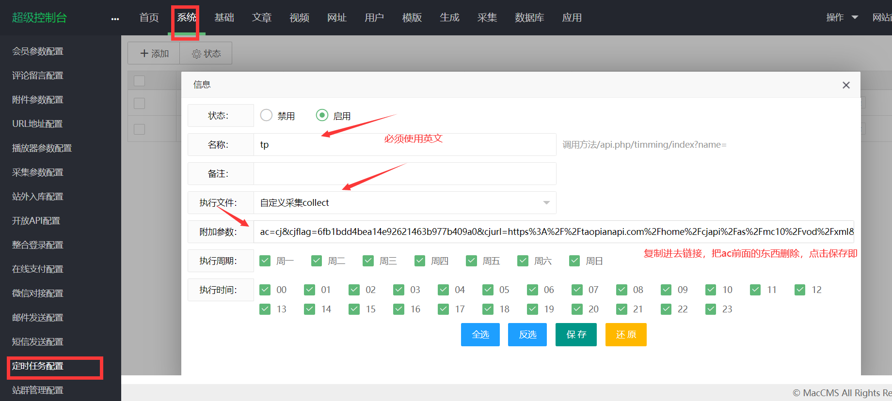
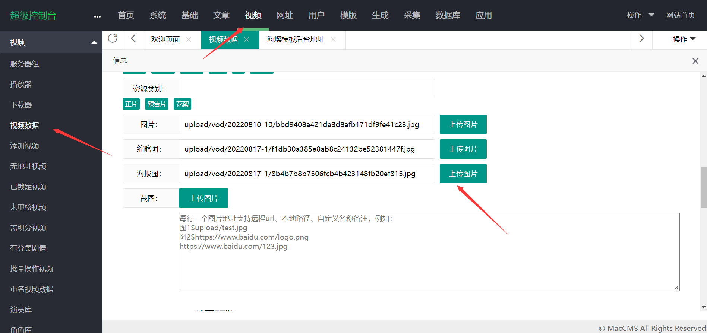
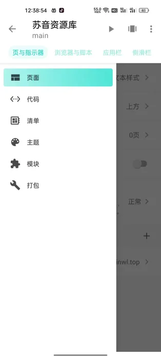
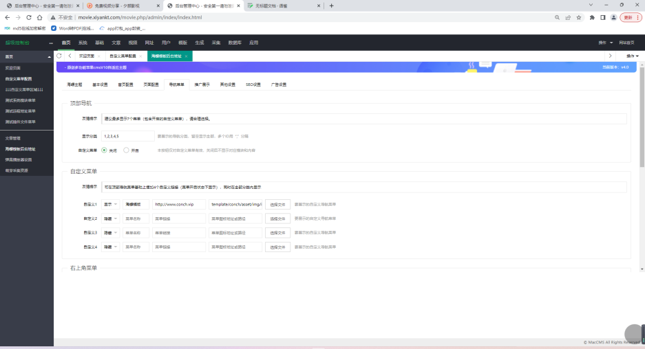

视频地址：https://www.bilibili.com/video/BV1814y147tT?t=586.5


雨雀地址：https://www.yuque.com/suyin-dbpen/xnxygy/rgbscf


组件下载地址：https://wwpq.lanzoum.com/io4Q00qvbrne


# 1.ubuntu安装宝塔面板

```shell
wget -O install.sh http://download.bt.cn/install/install-ubuntu_6.0.sh && sudo bash install.sh ed8484bec
```

# 2. 远程链接查看

访问 http://192.168.132.128:27067/defa6112
输入用户名和密码
绑定宝塔账号


# 3.安装好NGINX+PHP7.0+MYSQL8

安装php7.0的扩展，fileinfo和 sg11，不安装网站会搭建失败。


两个扩展都全部安装好了之后


点击-服务-重载配置
这样我们的网站环境就配置完成啦


# 4.下载苹果cms并安装

https://www.applecms.cc/down.html

先创建好网站，试试网站能不能访问如果不能访问，看看是否添加了网站解析，添加了ssl证书。

之后再进行上传进网站根目录，放进压缩包解压即可。




注意文件夹里的所有内容都要放到网站根目录下！


这时候你访问网站会看到这样的界面


点击安装此时没有红字提示就可以进行下一步（`如果有红字，就是第一步的扩展没安装好，或者是php版本问题，这里我安装的是php7.0版本`）


点击下一步，输入数据库账号密码，测试连接即可，如图所示就成功了

然后输入你的管理员账户和密码，也就是网站管理后台的账号跟密码

点击下一步即可


如图安装成功


会跳转到这个页面，再宝塔中将根目录中的admin.php改成你想要的登录后台地址即可

比如movie.php 那么后台登录地址就是  https://域名/movie.php


至此，你可以登录后台看到这些页面了


# 5.安装海螺模板

将海螺模板放到网站 template文件夹中 点击解压即可，看到conch文件夹就成功了。


下一步我们切换模板   系统--网站参数配置--网站模板选择conch--

点击下方的保存即可


这时候你应该可以访问网站看到下面的界面


海螺自定义菜单设置

海螺模板有自带的模板设置,点击首页--自定义菜单配置

添加如下内容：

刚才我更改的admin.php为movie.php  那么就填下面内容，注意逗号是英文的！

```
海螺后台地址,/movie.php/admin/conch/theme

```


保存后，点击右上角的清除缓存，即可看到左边多了一栏菜单，你可以在这里自定义设置内容，这里不再多说。



# 6.采集视频(可选，可以直接采用插件)

网站是空白的不要担心，接下来采集视频就可以丰富你的网站了，我这里分享一些采集接口。


## 采集渠道官网分享：

陶片 https://www.taopianzy.com/home/help.html   

金鹰 https://jinyingzy.net/  

红牛https://www.hongniuziyuan.com/ 

 ck  https://ckzy.me/index.php/art/detail/id/1.html

百度云http://www.bdzy.com/ 


## 采集接口分享

**资讯接口：**

百度云资讯接口：https://api.apibdzy.com/api.php/provide/art/?ac=list   json

**视频接口：**

百度云接口 ：https://api.apibdzy.com/api.php/provide/vod/?ac=list        json

闪电资源 ：https://sdzyapi.com/api.php/provide/vod/at/xml/                    xml

金鹰资源： https://jyzyapi.com/provide/vod                                                     json

淘片资源： https://taopianapi.com/home/cjapi/as/mc10/vod/xml            xml

红牛资源： https://www.hongniuzy2.com/api.php/provide/vod/at/xml/  xml

ck资源   ：  https://ckzy.me/api.php/provide/vod/?ac=list                            json


## 导入播放器

第一步我们首先要导入播放器才能开始采集，

先找到上方的官网，随便找一个打开，一定要找到maccms10这个分类

下面会看到采集地址


再往下拉会看到播放器地址，点击下载即可。

如图所示，点击视频----播放器--导入刚才下载的txt文件即可。

这里面也有详细的导入教程


注意：每个采集接口都有独立的播放器需要下载，需要的可以去个别官网去找到下载，这里不再做过多演示了。

## 采集视频配置

复制刚才的接口   采集--自定义接口---导入--复制接口地址--测试---如果是xml就选择xml

选择视频点击保存即可



点击系统--采集参数配置--点击同步图片--tag--二次更新规则（千万不要选择图片）

否则网站会显示不了图片


## 分类设置

在采集视频之前，你必须设置分类才能开始采集 基础--分类管理--设置名称


这里演示我只设置一个就行了，大家正式运营需要都添加上，具体设置什么名称可以参考采集站的分类


## 绑定分类

采集--自定义接口--点进去


点击绑定，选择帮绑定的分类即可


## 开始采集

这里可以选择采集当天、采集本周、采集所有


采集页面如图，没有绑定分类的会采集失败


现在你的采集视频就出来啦（视频中的广告都是播放器采集接口带的）


# 7.定时采集

每天采集接口都会更新新的内容，我们如果每天手动的去点击肯定是不现实的，那么苹果cms也提供了强大的定时采集功能可以和宝塔完美的融合起来。


 复制链接 

采集--自定义接口--选择采集当天还是采集本周的---右键那个按钮 --复制链接地址


 定时任务配置 

系统--定时任务配置--添加--输入名称--复制链接（删除ac前面的东西）--全选---保存即可




 宝塔定时配置 

刚才的页面，右键测试按钮--复制链接配置


进入宝塔面板---计划任务--访问url--输入你能看懂的任务名称---执行周期---复制刚才的url地址保存即可

执行周期不懂的可以看下图。根据自己的情况配置，间隔不要太小，服务器压力会变大


添加任务后，点击执行即可


那么采集工作就开始啦，你可以在日志中看到采集状态，显示成功就是采集完成了


偶尔提示这个也没有关系，它依然在运行采集中


# 8.幻灯片设置

如果觉得你的网站太空洞，其实可以设置一个幻灯片，让你的网站丰富美观起来，就像这样


设置起来也非常简单，首先进入海螺模板，找到这个幻灯片模式，要设置成大图模式才可以正常显示


视频--视频数据--找到视频--编辑---上传海报（可以去其他视频网站下载一下。f12这个不用我教你们了吧）




然后保存，设置推荐9 即可显示了


# 9.快速添加分类

请直接用我那个数据库的sql执行以下


进入数据库

点击管理登录进去


登录完成后，找到mac_type点击即可。

你的数据库这里的信息没有电影 这些   只有分类

我们需要先把这个删除，选中mac_type 删除即可


导入我配置好的数据库文件

上方选择导入，选择刚才下载的文件导入即可。最后点击执行。其余东西不用动


这时候你会发现 mac_type 出现了我已经配置好的分类。


# 10.搭建手机app

平常大家可能会需要将自己的网站封装成app方便用户的访问，如果不会编写代码，想要快速一键生成的可以继续往下看了。


首先你需要下载fusionapp 


下载地址：https://www.suyinwl.top/840.html


1.打开软件以后点击右小角的加号，如图所示


2.输入自定义应用名称，下面的应用包名会自动填写，不用管。点击创建即可。


3.打开生成的应用包，点进去，找到浏览页，输入网站名称及网站地址，网站地址要加http


4.点击完成后，点击右上方的运行按钮即可运行查看了。


如果想要打包让别人也能安装上，左侧侧滑栏找到打包安装即可。





更多软件设置还等待大家自己去探索 

# 11.弹幕插件安装

## 插件介绍

苹果CMS V10整合DPlayer播放器插件，本播放器调用 苹果CMS V10函数，支持多项功能，如弹幕设置、广告配置、播放器基本信息配置等，对于用户来说绝对非常适用。

本插件从网络上收集整理的，免费提供使用，不包技术支持、指导修改等服务。

## 特色功能

- 可选弹幕功能，可开启发送弹幕
- 自定义播放器右键、自定义LOGO、封面图片
- 播放前置图片广告、播放前置视频广告
- 播放暂停广告、全局广告开关等

## 使用方法

1.下载后将插件上传至苹果CMS V10根目录下，然后解压覆盖

2.在苹果cms后台快捷菜单设置如下代码：

```
弹幕播放器设置,dmplayer/system
```

[](https://www.mycj.pro/wp-content/uploads/2023/03/1679056358-596de22a00ceb96.png)

3.刷新网页，在欢迎页面点击刚刚设置的“弹幕播放器设置”即可开始设置管理

## 调用播放器方法

### 方法一

在 [萌芽采集插件（点此下载插件） ](https://www.mycj.pro/mycj-down)里面，选择一个资源站，点击播放配置，在弹出窗口中，输入播放器调用地址，调用地址如下：

```
/static/player/cj/dplayer-dm.html
```

[](https://www.mycj.pro/wp-content/uploads/2023/03/1679053403-596de22a00ceb96.png)

[](https://www.mycj.pro/wp-content/uploads/2023/03/1679053302-596de22a00ceb96.png)

### 方法二

在后台，视频，播放器管理界面，点击一个你要编辑修改调用的播放器，切换到“播放器代码”，输入下方的代码即可

```shell
MacPlayer.Html='<iframe width="100%" height="'+MacPlayer.Height+'" src="'+maccms.path+'/static/player/cj/dplayer-dm.html" frameborder="0" allowfullscreen="true" border="0" margin margin scrolling="no"></iframe>';MacPlayer.Show();
```

[](https://www.mycj.pro/'+maccms.path+)

[](https://www.mycj.pro/wp-content/uploads/2023/03/1679052660-596de22a00ceb96.png)

 

## 截图展示

[](https://www.mycj.pro/wp-content/uploads/2023/03/1679052727-596de22a00ceb96.png)

[](https://www.mycj.pro/wp-content/uploads/2023/03/1679052434-596de22a00ceb96.png)

[](https://www.mycj.pro/wp-content/uploads/2023/03/1679052446-596de22a00ceb96.png)

# 12.萌芽采集插件安装

安装步骤：

1、将 addons 文件夹下的 和 static 文件夹下的 放到你苹果cms程序的根目录并覆盖

2、登录程序后台，找到导航栏最后面的“应用”，打开“应用市场”

3、看到“萌芽采集Pro插件”后，点击“启用”，

4、成功启用后，刷新后台，在后台首页左侧的快捷菜单栏，即可看到入口


# 13.海螺模板后台配置





注 sql导入 账户movie 密码baby5201314

# 14.免费将h5打包app和ios的地址：https://yuntu2.com/


# 15.seo工具

链接：https://pan.baidu.com/s/1rYi1udcoh2ys_VVsdCrJfw 
提取码：4qmo